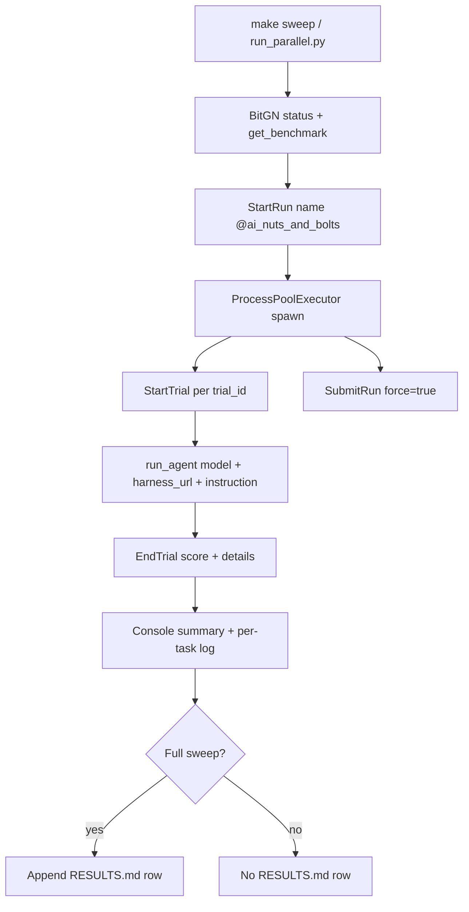
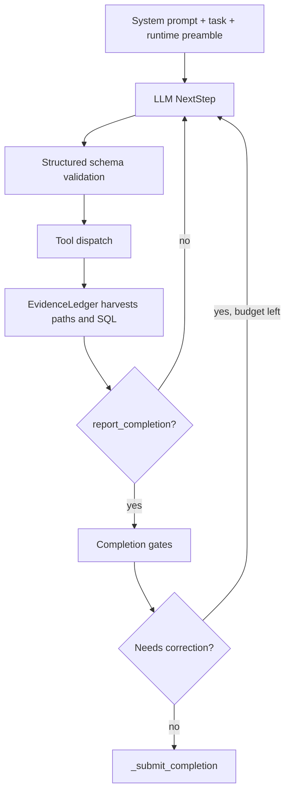
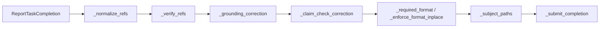
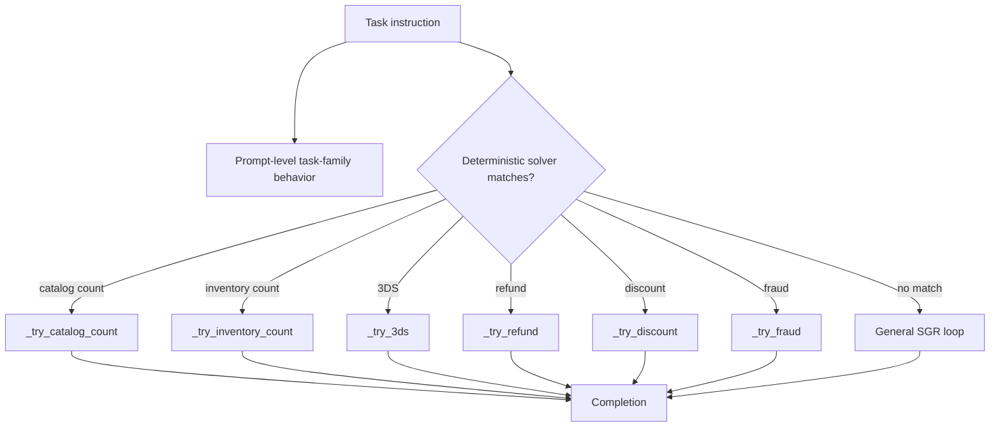
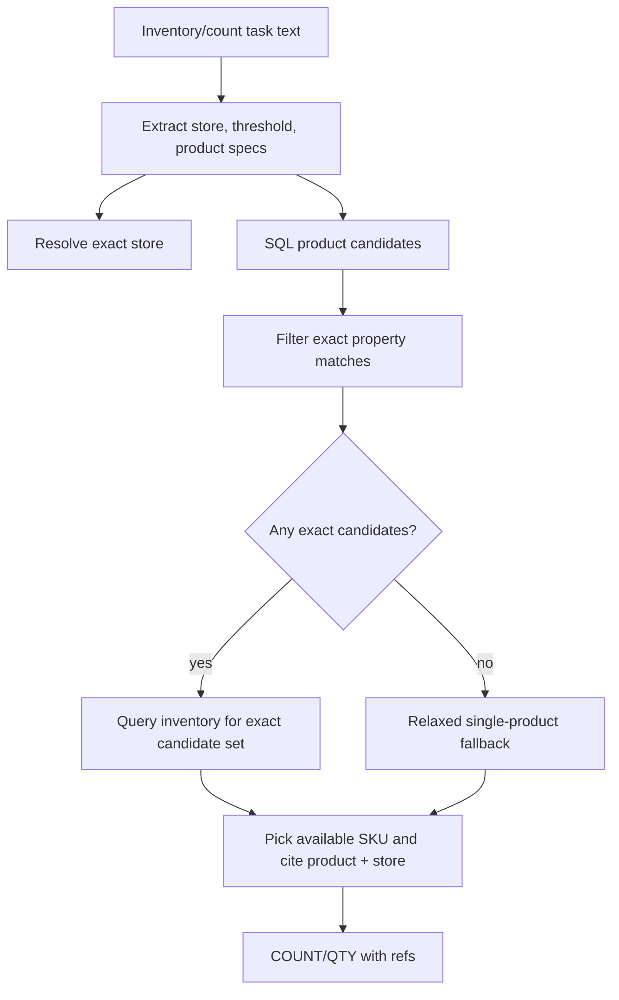
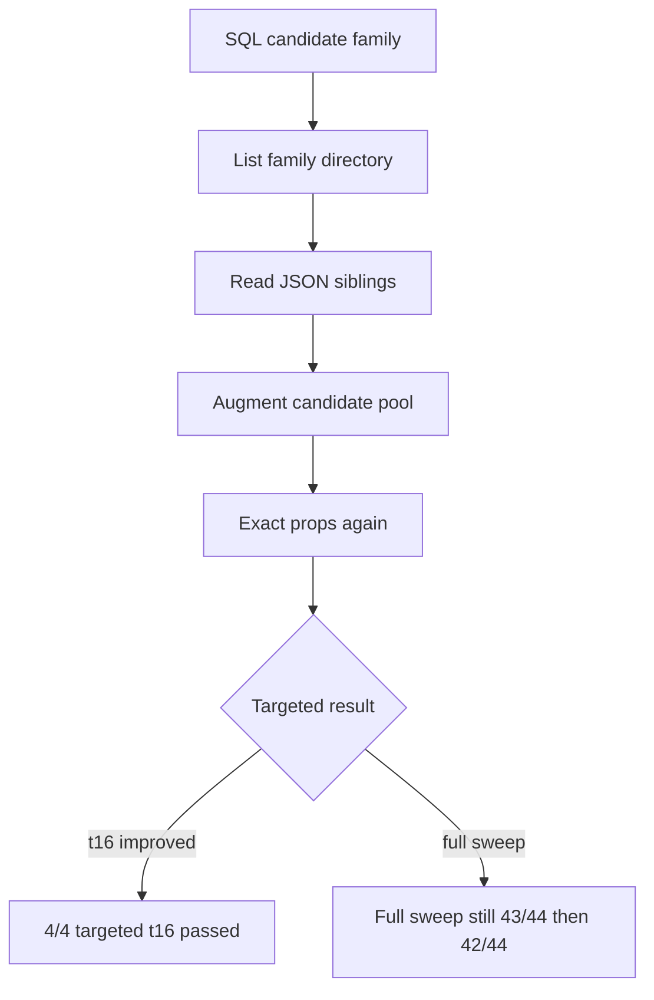
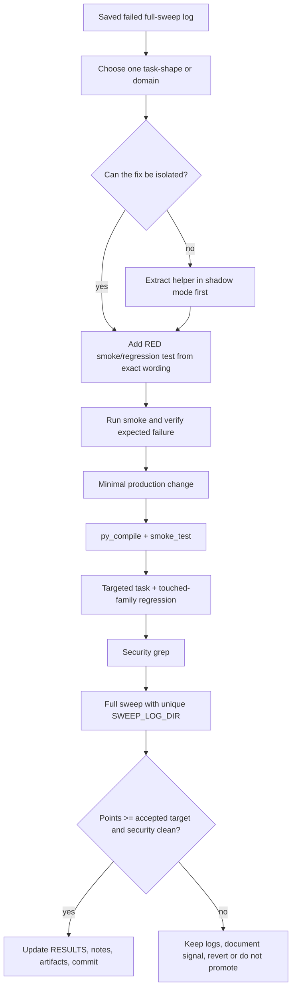

# BitGN ECOM Agent Architecture

This document captures the current submission architecture, the observed
degradation pattern, and the risk points to use before the next round of tuning.
It is intentionally operational: every proposed change should map to one box in
these diagrams and one validation gate in the risk table.

## Current Milestone

As of 2026-05-27, the current saved leaderboard milestone is:

- Milestone profile: mixed `claude:opus` + `codex:gpt-5.5`.
- Full-sweep result: `50.00/50` points (`100.00%`) with `50/50` perfect tasks.
- Accepted sweep logs:
  `artifacts/sweeps/2026-05-27-goal495-mixed-opus-codex55-r1/`.
- Local wall time: `350s`; the mixed runner records `agent_seconds`,
  `platform_open_seconds`, and `slot_wait_seconds`.

The operational target is leaderboard points, not perfect-task count. Perfect
count remains useful triage, but fractional task scores count toward the goal.

## Previous Codex Milestone

As of 2026-05-26, the previous codex-only scoring milestone was:

- Milestone commit: `e4a2d41` (`Route t45 have-ready inventory wording`).
- Documentation commit: `a7de1b5` (`Record v47 46-of-47 milestone retrospective`).
- Tag: `bench-ecom1-dev-v47-46of47-20260526`.
- Full-sweep result: `46/47` (`97.9%`) with `codex:gpt-5.3-codex`,
  `PARALLEL=6`, `275s` wall.
- Accepted sweep logs:
  `artifacts/sweeps/2026-05-26-t45-have-ready-full-codex53/`.
- Milestone retrospective and test-data index:
  `artifacts/milestones/2026-05-26-v47-46of47-retrospective.md`.

The benchmark denominator changed during the work (`44 -> 46 -> 47 -> 50`), so
a change only counts as progress if a full sweep raises or preserves the
accepted points target and is security-clean.

Later diagnostic runs that scored fewer points are not the current state.
In particular, the 2026-05-27 portfolio comparison is evidence about backend
behavior on the then-current 48-task denominator, but its best codex result was
`44/48`; it must not replace the accepted `50.00/50` mixed milestone as the
leaderboard baseline for future development.

## Historical Rollback Point

As of the final 2026-05-26 rollback, `agent.py` and `smoke_test.py` are restored
to the exact tagged 44/44 baseline:

- Code source for `agent.py` and `smoke_test.py`: `ae75479`
  (`bench-ecom1-dev-codex53-44of44-20260525`).
- Historical recorded run for that tag: `2026-05-25 13:40`,
  `codex:gpt-5.3-codex`, `100.0%`, `44/44`, `270s`, `PARALLEL=6`.
- Fresh validation after restoring that exact code on 2026-05-26 scored
  `97.7%` (`43/44`) at `268s`; only `t05` missed by answering `<YES>` where the
  grader expected `<NO>`.
- Newer diagnostic rows and sweep logs are preserved so rejected experiments can
  still inform the next design.

The later experimental family JSON augmentation and conflict-product solver were
not promoted. Their logs are useful evidence, but the behavior was not globally
stable.

Later v46/v47 work moved forward from that rollback point with isolated
parser/routing fixes, not broad resolver rewrites. The current code is no longer
the raw `ae75479` baseline; `ae75479` remains the known historical fallback.

## Control Plane



Key properties:

- Trials are independent; `PARALLEL=6` is the current quality envelope.
- Worker crashes become score rows instead of killing the whole sweep.
- Full sweeps append to `RESULTS.md`; partial sweeps only write logs.
- Platform-reported time is not the same as local wall time. Use local wall time
  for iteration speed, but trust BitGN platform time for leaderboard speed.

## Mixed Runner

`run_mixed_parallel.py` is a separate diagnostic runner. It must not replace
`run_parallel.py` until a full mixed sweep proves it preserves or improves the
accepted gates.

Required shape:

- One `StartRun` and one platform-provided list of trial ids.
- After `StartRun`, the runner reads `GetRun` trial metadata and reserves the
  planned task's model semaphore before `start_trial()`. This keeps model-slot
  wait out of BitGN's platform-open trial duration, which is what the
  leaderboard reports as run time. If metadata is absent, `trial_id == task_id`
  remains a fallback.
- Simple/deterministic tasks may run on `CLAUDE_MODEL_ID=claude:sonnet`.
- Fragile resolver, fraud, archive, quote, ambiguous, and security-sensitive
  tasks stay on `CODEX_MODEL_ID=codex:gpt-5.3-codex` unless evidence says
  otherwise.
- `MIXED_PARALLEL` can be 12, but per-model semaphores cap concurrency:
  `MIXED_CLAUDE_LIMIT=6` and `MIXED_CODEX_LIMIT=6`.
- The runner writes `route_manifest.json` and `sweep_report.json` in the unique
  `SWEEP_LOG_DIR`.

Promotion rule: a mixed sweep is diagnostic evidence only unless it passes the
same points, percent, and security gates as the accepted profile.

## Agent Loop



The loop is schema-guided, but the schema is not enough. The model can still
miscount, cite unobserved paths, or make a yes/no polarity error. Code gates are
the protection layer.

## Completion Gates



Gate responsibilities:

- `EvidenceLedger` records confirmed `/proc` refs from SQL `path` columns and
  file-system tools.
- `_grounding_correction` rejects OK completions with unobserved `/proc` refs.
- `_claim_check_correction` re-runs numeric aggregation queries before submit.
- `_required_format` enforces exact answer formats without inventing polarity.
- `_subject_paths` makes named baskets/payments/returns explicit when already
  observed.
- `_submit_completion` performs final normalization and auto-cites required
  policy docs for known workflows.

Risk boundary: correction budget is shared. A new correction gate can starve a
later, more important gate if it fires too broadly.

## Task Family Routing



Current lesson: broad deterministic branches are high-risk. The rejected
conflicting-product solver fixed one `t05` seed but regressed `t08` by treating a
valid multi-valued product requirement as impossible. New solvers should be
task-family gated and shadow-tested before they are allowed to submit answers.

Latest v47 lesson: narrow routing branches can be safe when they are
non-overlapping and backed by RED tests from saved failed logs. Successful recent
examples:

- `t26`: percent-sign parsing for explicit over-policy discounts.
- `t41`: `payment verification` wording routed into deterministic 3DS recovery.
- `t45`: uncovered inventory wording routed into deterministic inventory instead
  of the LLM path.

## Data Plane

```mermaid
flowchart LR
    Runtime[BitGN VM runtime] --> FS[/proc and /docs files]
    Runtime --> SQL[/bin/sql projection]
    Runtime --> Tools[/bin checkout, discount, payments, id, date]
    FS --> Ledger[EvidenceLedger]
    SQL --> Ledger
    Tools --> Ledger
    Ledger --> Gates[Completion gates]
```

Important mismatch:

- SQL is fast and complete for many tasks, especially counts and inventory.
- Product JSON siblings can contain candidate paths not surfaced by the current
  SQL candidate query shape.
- Docs can encode policy exceptions that raw SQL counts do not capture.

This mismatch is the core source of recent instability: single-source fixes
improve targeted tasks and then fail on another family that needs a different
source of truth.

## Inventory Resolver



Rejected experiment:



The family JSON idea is promising, but it must be isolated behind a typed
resolver contract. Adding it directly to all resolver paths made it harder to
reason about cross-task drift and increased runtime.

## Degradation Analysis

### v46 Refresh

On 2026-05-26 the benchmark API reported `46` tasks instead of `44`. A fresh
full sweep of the restored `ae75479` baseline scored `44/46` (`95.7%`) at
`265s`, security clean. The two newly visible tasks, `t45` and `t46`, passed.
That baseline is tagged as `bench-ecom1-dev-v46-baseline-44of46-20260526`.

The misses were both discount-policy variants:

- `t26`: explicit `6% service_recovery` request should be unsupported; the
  deterministic solver capped it to `5%` and applied it.
- `t42`: authority denial was correct, but the new grader requires token
  `DESK_COVERAGE_NOT_DISCOUNT_AUTHORITY_2021_08_09`.

This narrows the next growth point: patch discount policy handling first, then
return to inventory/product resolver work.

The discount-policy patch was then implemented and validated. Targeted v46 runs
passed `t26`, `t42`, and `t46`; full v46 validation still scored `44/46`, but the
remaining misses moved to unrelated inventory/catalogue ref tasks (`t16`, `t45`).
So the discount branch is closed for now; the next risk is resolver/ref stability.

Recent full sweeps after the last recorded 44/44:

- `2026-05-26 07:59`: `41/44`
- `2026-05-26 08:09`: `41/44`
- `2026-05-26 08:22`: `42/44`
- `2026-05-26 08:32`: `43/44`
- `2026-05-26 09:01`: `42/44`
- `2026-05-26 09:26`: `41/44`
- `2026-05-26 09:46`: `43/44`
- `2026-05-26 09:52`: `42/44`
- `2026-05-26 11:39`: `43/44` after restoring exact `ae75479` tagged baseline

No local `RESULTS.md` row in the last two hours of the 2026-05-26 11:54 CEST
audit was 44/44. The last recorded 44/44 row remains historical, not freshly
reproduced.

Observed causes:

1. Targeted fixes were promoted before they had enough full-sweep evidence.
2. Deterministic product-check logic confused "one item has two incompatible
   values" with "a valid item has multiple required values".
3. Catalogue count logic oscillated between raw SQL truth and policy-note truth.
4. Inventory resolution uses mixed evidence sources without a typed confidence
   model.
5. More prompt/gate complexity increases runtime and consumes correction budget.
6. Higher parallelism improves local wall time only until quality drops; beyond
   `PARALLEL=6`, it is mostly stress testing.

## Risk Register

| Area | Failure mode | Evidence | Guardrail |
|---|---|---|---|
| Product checks | False `<NO>` for valid multi-property SKU | `t08` failed in `2026-05-26-family-json-conflict-solver-full-codex53` | Keep product-check on SGR path until a typed resolver exists |
| Catalogue counts | Raw SQL count ignores policy addendum | `t12` failed with `[QTY:264]`, expected `[QTY:252]` | Treat docs as first-class inputs; claim-check must replay the same adjusted query |
| Inventory | SQL candidates miss JSON siblings | `t16` diagnostics show required sibling refs outside exposed candidate set; v46 full after discount fix still missed `t16` | Build shadow-mode `resolve_product_variant()` before behavior change |
| Inventory/catalog refs | LLM cites invalid product ref in v46 multi-product availability task | `t45` failed targeted and full runs with different invalid refs | Add typed product-ref validation/recovery for availability tasks |
| Grounding refs | Correct answer with missing required citation | Historical `t15/t16/t36` misses | Continue ledger-backed grounding gate; do not fabricate refs |
| Security | OK answer on security-denial task | No current miss in latest sweeps | Security grep is a hard reject gate |
| Discount policy | Silent cap on explicit over-policy request | v46 `t26` expected unsupported, solver applied 5% | Explicit requested percent above policy max must return unsupported/clarification |
| Discount authority | Missing required current-update token | v46 `t42` expected `DESK_COVERAGE_NOT_DISCOUNT_AUTHORITY_2021_08_09` | Denial refs/tokens must include current update document requirements |
| Speed | Local wall time underestimates platform time | Platform showed ~18-23 min for local ~226-236s runs | Optimize platform-visible task duration, not only local wall |
| Parallelism | Rate/quality collapse above 6 | `PARALLEL=7/10/12` rows degraded | Use `PARALLEL=6` for scoring, higher only for diagnostics |
| Prompt bloat | Slower steps and correction starvation | Runtime grew with extra rules | Prefer typed code gates over broad prose when invariant is precise |

## Growth Points

Recommended order:

1. Build a typed `resolve_product_variant(task_spec)` helper in shadow mode.
   It should return candidates, evidence source, confidence, and rejected
   alternatives without changing submitted answers.
2. Create per-task diagnostic JSON directories beside logs: prompt snapshot,
   tool trace summary, final answer, score detail, and gate decisions.
3. Split deterministic solvers into narrow task-family contracts. A solver must
   declare which format, family, refs, and policy docs it owns.
4. Make catalogue-count claim-check replay the exact adjusted query used for the
   answer, including policy-note exclusions.
5. Add a stability gate before promotion: at least two full `codex:gpt-5.3-codex`
   sweeps or one full 44/44 plus targeted repeats for every task family touched.
6. Only after quality is stable, optimize platform time: task ordering,
   cheaper deterministic preflight, and fewer full LLM turns on known policy
   families.

## Controlled Improvement SDLC

The tuning loop is a benchmark SDLC, not a normal feature-development loop. The
primary artifact of each iteration is causal evidence: one behavior change, one
RED test, targeted logs, one full sweep, and a written decision.



### SDLC Rules

1. One production behavior change per cycle. Do not bundle parser, resolver,
   prompt, and ref-policy changes.
2. Write a RED test from a saved failed log before changing production code.
   If the test cannot be made narrow, first extract a helper or diagnostic seam.
3. Prefer isolated routing/parser fixes for new wording shapes. They may add a
   non-overlapping branch, but must not alter existing branches, `_select_product()`,
   or global ref policy.
4. Targeted pass is only a local signal. It is not leaderboard progress.
5. A change is accepted only by a full sweep that is security-clean and raises or
   preserves the accepted points target.
6. Use a unique `SWEEP_LOG_DIR` for every full attempt. Do not overwrite the
   milestone logs with a noisier repeat.
7. Always grep for security misses before commit:
   `rg "expected outcome OUTCOME_DENIED_SECURITY, got OUTCOME_OK" artifacts/sweeps/<dir>/*.log`.
8. Commit the code, tests, `RESULTS.md`, notes, and logs atomically. If the
   change is not accepted, keep diagnostic logs only when they explain a rejected
   design.
9. Mixed-model optimization is mandatory diagnostic work before tournament mode:
   use `run_mixed_parallel.py`, never rewrite the accepted `run_parallel.py`
   path for this experiment.
10. Push only after explicit approval.

### Acceptance Levels

| Level | Meaning | Commit? |
|---|---|---|
| RED/GREEN smoke | Unit-level deterministic behavior works | No, unless followed by targeted/full evidence |
| Targeted pass | The named task shape can pass | No, not by itself |
| Family regression pass | Adjacent known tasks did not fail in that sample | Still no, not by itself |
| Full sweep preserves points target | Safe maintenance / documentation-worthy | Yes, if security clean |
| Full sweep raises points target | Scoring milestone | Yes, tag and document |

### Current Stable Target

The accepted target is `50.00/50` points on `bitgn/ecom1-dev` v50. The next
accepted improvement must preserve the full points total or improve time,
preserve the configured percent gate, and remain security-clean.

## Promotion Contract

A change can be promoted only if all are true:

- Smoke gate passes:
  `uv run python -m py_compile agent.py llm.py && uv run python smoke_test.py`.
- Target tasks pass with saved logs.
- Full sweep is security-clean:
  `rg "expected outcome OUTCOME_DENIED_SECURITY, got OUTCOME_OK" <logs>`.
- The full-sweep result improves or preserves the accepted points target without
  moving failures into a more serious family.
- `RESULTS.md` and `BENCHMARK_NOTES.md` explain what changed and why.

If a change improves targeted tasks but regresses a different family in a full
sweep, keep the logs, document the signal, and revert the behavior.
